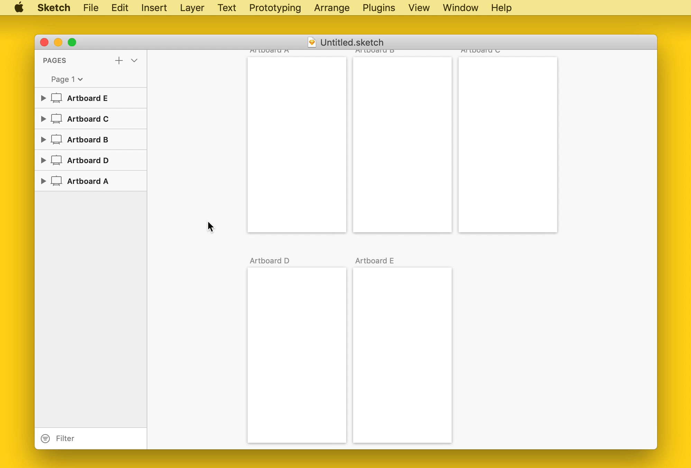

# Sort Layer List 

> A Sketch plugin to sort the layer list by name or layer position

## Commands

### Sort Selected Layers By Name

- Sorts layers in alphabetical order

### Sort Selected Layers By Layer Position

- Sorts layers by their:
  - X position
  - Y position
  - Y and X position

### Smart Sort

- Sorts layers by their Y and X position, but preserves the layers’ visual “stack order” on the page

## Installation

1. [Download and unzip the latest release](https://github.com/yuanqing/sketch-sort-layer-list/releases)
2. Double-click `Sort Layer List.sketchplugin` to install

## License

[MIT](LICENSE.md)
